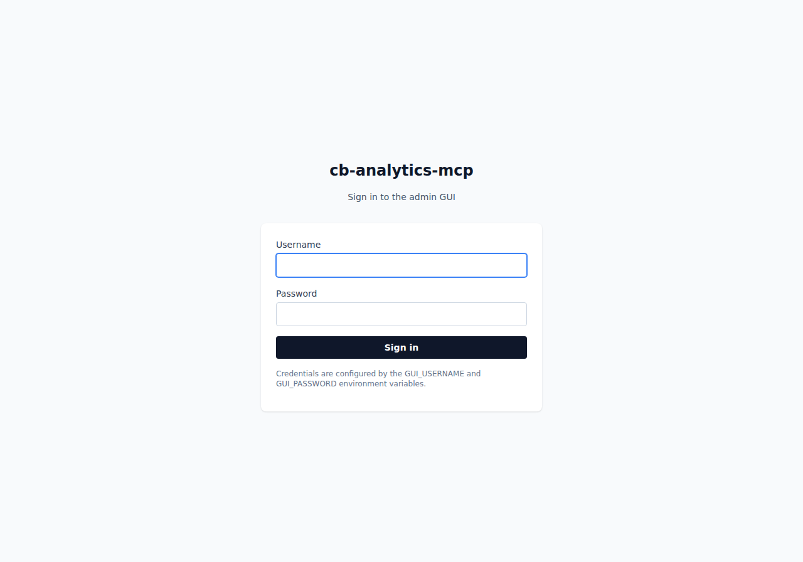
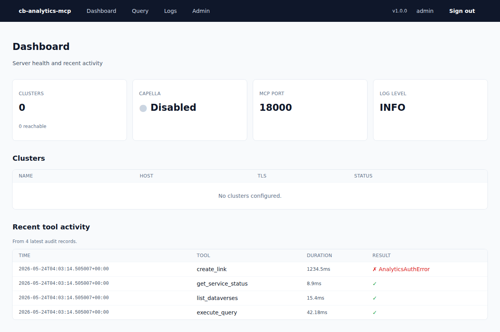
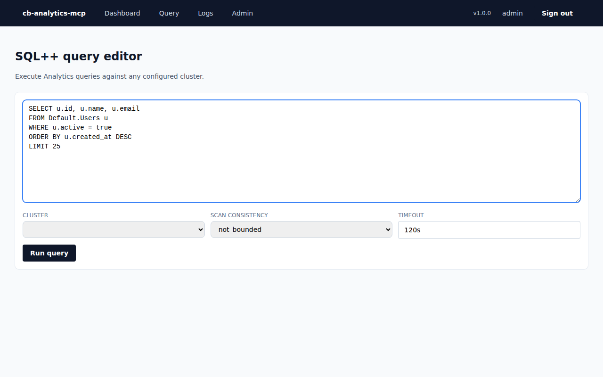
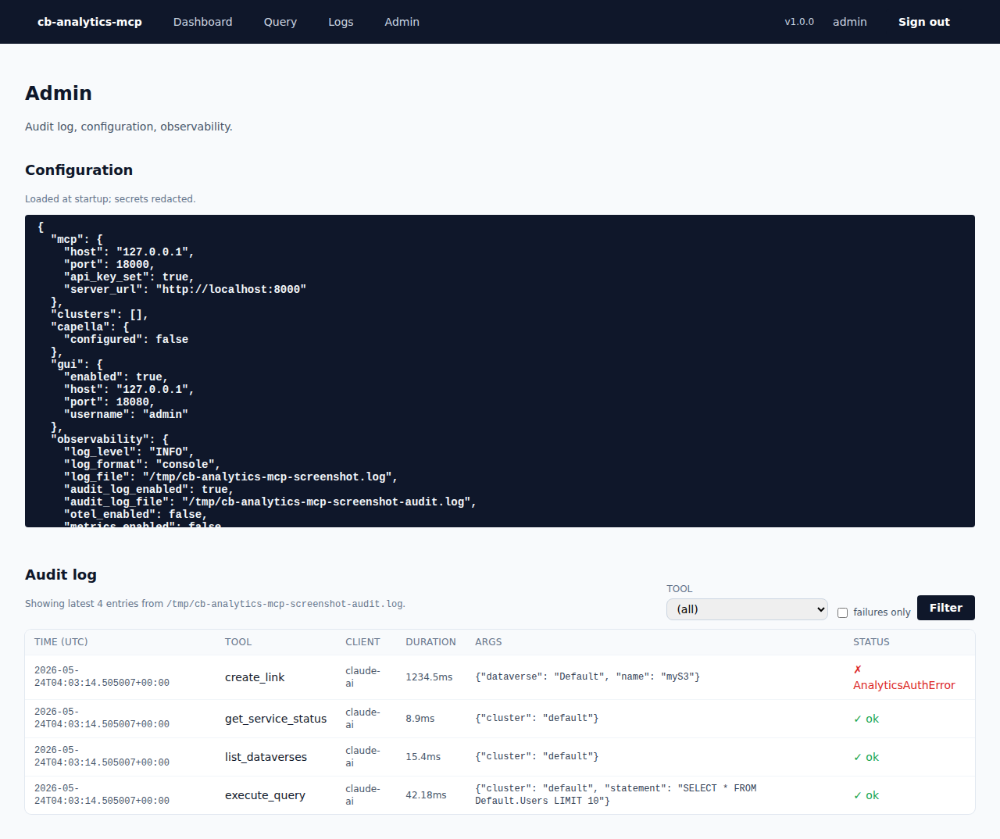
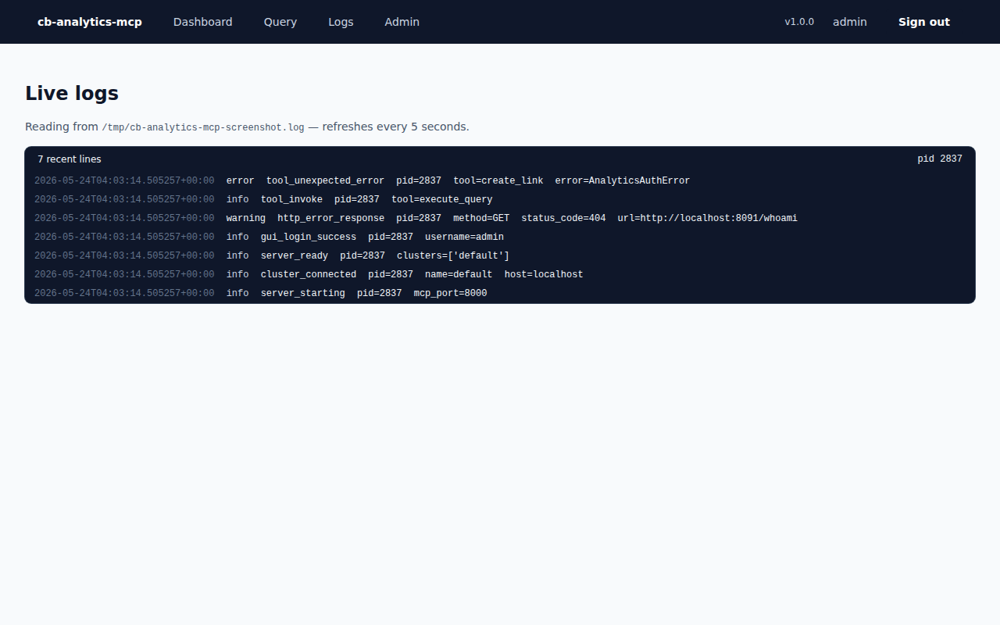

# GUI walkthrough

The bundled GUI is at `http://<host>:8080` and shares the same process as the
MCP server. It exists for operators who want a quick, read/write,
human-friendly view alongside what Claude is doing.

## Login

Credentials come from `GUI_USERNAME` and `GUI_PASSWORD`. The submit handler
uses `hmac.compare_digest` to avoid timing leaks.

## Dashboard

The landing page summarises cluster reachability and recent activity. Each
cluster gets a row with a live "Reachable" / "Unreachable" badge driven by
`AnalyticsClient.ping()`.

Every cluster row has a **Test** button. Pressing it issues a fresh ping
to that cluster (without reloading the page) and replaces the button with
either a green "reachable in N ms" indicator or a red "failed after N ms"
indicator. Useful for verifying your cluster config after editing
`.env` or restarting Couchbase without waiting for the next page refresh.

The "Recent tool activity" table reads the tail of the audit log, so you can
see what Claude is doing in (near) real time.

## Query editor

`/query` lets you run arbitrary SQL++ against any configured cluster. The
form posts to `/query/run` and HTMX-swaps the result fragment in place — no
full-page reload.

Each result includes:

- Execution and elapsed time
- Result count and processed-object count
- Any warnings from the Analytics service
- The raw JSON in a scrollable code block

## Admin & audit log

`/admin` is the long-form audit-log viewer. The filter form supports four
dimensions, applied together:

- **From / To dates** — single-day or multi-day windows; date-only inputs
  are inclusive at both ends.
- **Tool** — dropdown populated with every registered tool name (not just
  the ones that have appeared in the log so far), so you can pre-filter
  to a tool you haven't called yet.
- **Failures only** — checkbox to show only records where `success: false`.

Changing any filter input updates the table in place via HTMX (no full
page reload); the same query parameters work on a plain GET as well, so
shareable URLs and no-JS browsers still work.

The config summary at the top is generated by `config_summary()`, the same
function that writes the startup log line, so it's guaranteed to show only
non-secret values.

## Live logs

`/logs` streams new log lines from `LOG_FILE` as they're written, using a
WebSocket (`/logs/ws`). Each line is parsed as JSON when possible — the level
badge gets coloured accordingly (info / warning / error / critical) and the
structured fields are shown inline. The status indicator at the top of the
page shows whether the connection is `● live` (WebSocket up) or
`● polling (WebSocket unavailable)` (fallen back to HTMX polling).

If the browser closes the WebSocket — usually because of a proxy that doesn't
allow upgrades, or because JavaScript is disabled — the page automatically
falls back to polling `/logs/tail` every 5 seconds, which serves the same
data as a server-rendered HTML fragment.

If `LOG_FILE` isn't set, the page tells you so. There's nothing to tail
when logs go only to stdout.

---

## Behind the scenes

- **Templating:** Jinja2 server-side rendering. No SPA, no build step.
- **Live updates:** WebSocket (`/logs/ws`) for the log tail, HTMX (`hx-get`)
  for everything else. Vanilla JS handles WS message rendering; no client-
  side framework.
- **CSS:** Tailwind via CDN — works without any compilation; minor helpers in
  `static/css/app.css`.
- **Interactivity:** HTMX, also via CDN, handles the query result fragment and
  the live log tail.
- **Sessions:** `starlette.middleware.sessions.SessionMiddleware` with a
  signed cookie keyed by `GUI_SESSION_SECRET`. 8-hour expiry.

## Regenerating screenshots

The PNGs in this directory are produced by `scripts/make_screenshots.py`,
which uses Playwright headless. The script:

1. Seeds the audit log with realistic sample records (so screenshots aren't
   empty).
2. Starts an in-process FastAPI server on `127.0.0.1:18080`.
3. Logs in and visits each page, saving full-page screenshots.

Run it with `make screenshots`.
